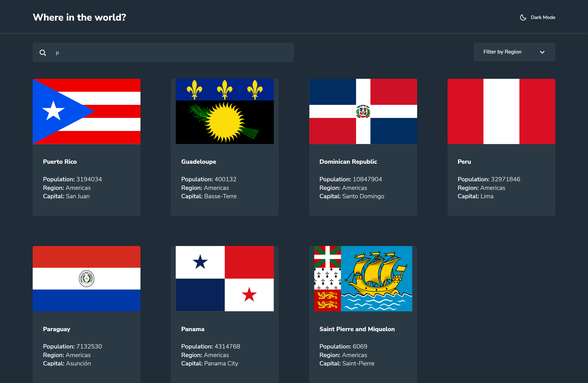
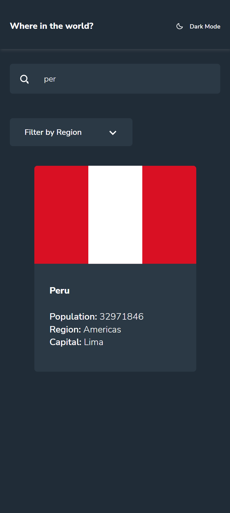
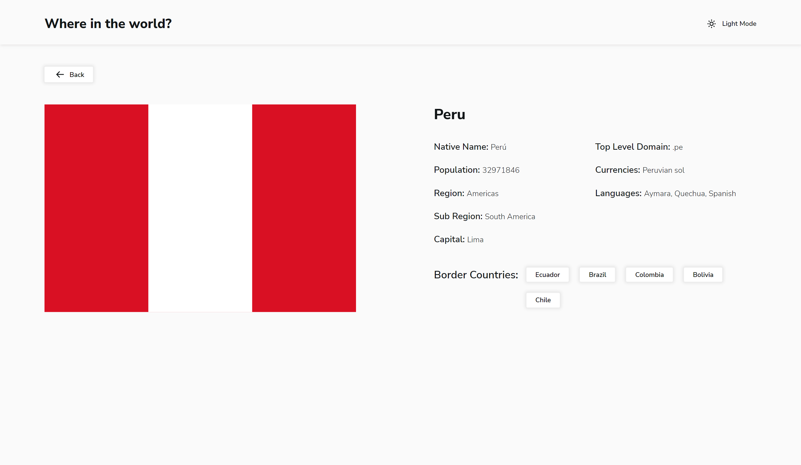
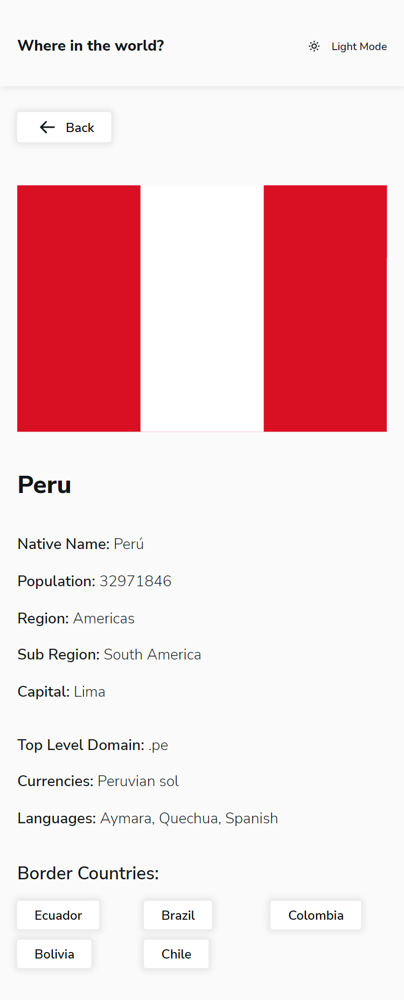

# Frontend Mentor - REST Countries API with color theme switcher solution

This is a solution to the [REST Countries API with color theme switcher challenge on Frontend Mentor](https://www.frontendmentor.io/challenges/rest-countries-api-with-color-theme-switcher-5cacc469fec04111f7b848ca). Frontend Mentor challenges help you improve your coding skills by building realistic projects.

## Table of contents

- [Frontend Mentor - REST Countries API with color theme switcher solution](#frontend-mentor---rest-countries-api-with-color-theme-switcher-solution)
  - [Table of contents](#table-of-contents)
  - [Overview](#overview)
    - [The challenge](#the-challenge)
    - [Screenshot](#screenshot)
    - [Links](#links)
  - [My process](#my-process)
    - [Built with](#built-with)
    - [What I learned](#what-i-learned)
    - [Useful resources](#useful-resources)
  - [Author](#author)

## Overview

### The challenge

Users should be able to:

- See all countries from the API on the homepage
- Search for a country using an `input` field
- Filter countries by region
- Click on a country to see more detailed information on a separate page
- Click through to the border countries on the detail page
- Toggle the color scheme between light and dark mode _(optional)_

### Screenshot

### Links

- [Solution URL](https://github.com/xsrpm/rest-countries)
- [Live Site URL](https://xsrpm.github.io/rest-countries/)

## My process

### Built with

- Semantic HTML5 markup
- CSS custom properties
- Flexbox
- CSS Grid
- Mobile-first workflow
- React
- Wouter
- CSS Modules

### What I learned

- CSS Modules
- useLocalStorage
- Wouter
- Dark/Light style theme

### Useful resources

- [CSS Modules](https://github.com/css-modules/css-modules)
- [CSS Modules with React Scripts](https://create-react-app.dev/docs/adding-a-css-modules-stylesheet/) - CSS modules with React Scripts
- https://css-tricks.com/css-modules-part-1-need/
- https://github.com/gajus/react-css-modules
- https://github.com/molefrog/wouter
- https://blog.logrocket.com/an-introduction-to-wouter-a-react-router-alternative/
- https://restcountries.com/
- https://usehooks.com/useLocalStorage/
- https://create-react-app.dev/docs/deployment/#github-pages
- https://www.freecodecamp.org/news/deploy-a-react-app-to-github-pages/
- https://github.com/molefrog/wouter#customizing-the-location-hook

## Author

- Website - [César Palma (XsrPm)](https://xsrpm.github.io)
- Frontend Mentor - [@xsrpm](https://www.frontendmentor.io/profile/xsrpm)
- Twitter - [@xsrpma](https://www.twitter.com/xsrpma)
